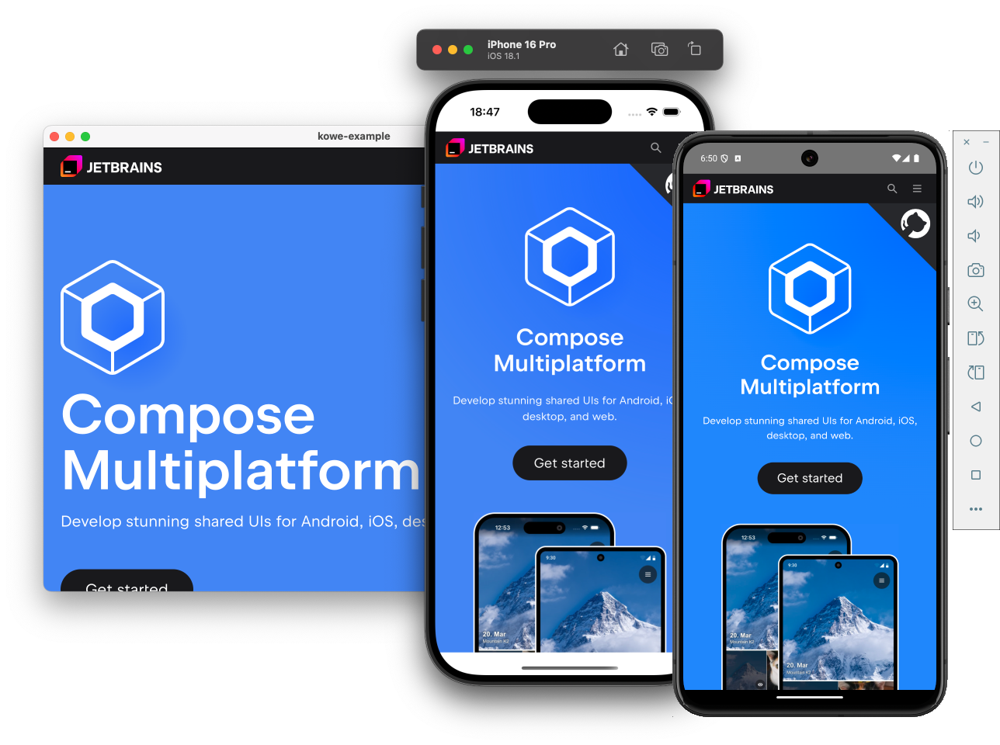

# Kowe - Compose Webviews for Kotlin Multiplatform

**Kowe** is a [Kotlin Multiplatform](https://www.jetbrains.com/kotlin-multiplatform/) library which enables you to include native WebViews in your [Compose Mulitplatform](https://www.jetbrains.com/compose-multiplatform/) Application on Android, iOS and Desktop.



---

## Getting Started

To start using **Kowe** you need to include its dependency in your `build.gradle.kts`:

```kotlin
commonMain.dependencies {
    implementation("dev.anthonyhfm:kowe:<current-version>")
}
```

## Usage

Take a look at the [example repository](https://github.com/anthonyhfm/kowe-example)

### Common (Android, iOS, Desktop)

Building WebViews with the **Kowe** library is very easy. All you need is a ***WebViewState*** and the ***WebView***-Composable. You can also do further configuration for your webview using the ***WebViewState***. 

Example Code:

```kotlin
@Composable
fun App() {
    val state = rememberWebViewState(url = "https://www.jetbrains.com/compose-multiplatform/")

    WebView(
        state = state,
        modifier = Modifier
            .fillMaxSize()
    )
}
```

### Desktop specific

For using **Kowe** in **Compose for Desktop** you will need to do some extra configuration:

1. Use the [Jetbrains Runtime with JCEF](https://github.com/JetBrains/JetBrainsRuntime/releases) to compile your application
2. Configure [needed JVM Flags](https://github.com/DatL4g/KCEF/blob/master/COMPOSE.md#flags) for setting up [KCEF](https://github.com/DatL4g/KCEF/tree/master)
3. Initialize the `WebViewCore` before starting your Application:

```kotlin
fun main() = application {
    WebViewCore.init() // <-- Initializing the Chromium Engine (runs blocking)

    Window(
        onCloseRequest = ::exitApplication,
        title = "kowe-example",
    ) {
        App() // <-- Your App

        DisposableEffect(Unit) { // Needed for closing the Chromium Engine
            onDispose {
                WebViewCore.close() // <-- Properly closing the Chromium Engine
            }
        }
    }
}
```

## Feature List

This is a list of all the features the **Kowe** library currently supports. This library is currently under heavy development and the feature list will most likely grow by a lot over time.

- Basic Web Views
  - Android (`android.webkitx`)
  - iOS (`WkWebView`)
  - Desktop (`KCEF/JCEF, Jetbrains Runtime JCEF edition`)
- Web Navigation
  - Load URLs
  - Load HTML
  - Reloading
  - Loading States
- Configuration (only for Android and iOS right now)
  - Enable / Disable JavaScript
  - Custom User-Agents
- URL Policies
- JavaScript Evaluation

## Issues

Feel free to test the **Kowe** library and submit issues and feature requests [here](https://github.com/anthonyhfm/kowe/issues)

## Credits

- [KCEF](https://github.com/DatL4g/KCEF/tree/master)